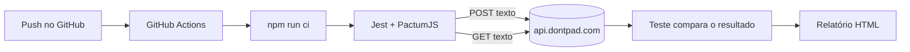

# Testes de API com Jest e PactumJS: Dontpad

[](https://github.com/Berbett/integration-tests-jest/actions/workflows/node.js.yml)

Testes automatizados de integração que verificam se a API do [Dontpad](https://dontpad.com) consegue **ler** e **escrever** texto, rodando sozinhos no **GitHub Actions** a cada push.

> Projeto baseado no template [ugioni/integration-tests-jest](https://github.com/ugioni/integration-tests-jest) (integração simples entre Jest e PactumJS).

**Autora:** Bettina

---

## O que é o Dontpad?

O Dontpad é um site de "bloco de notas público". Qualquer pessoa abre `https://dontpad.com/qualquer-nome` e o que for digitado ali fica salvo naquele endereço, sem login nem cadastro.

Por trás do site existe uma API HTTP (`api.dontpad.com`) que o próprio navegador usa para salvar e carregar o texto. Ela **não é documentada oficialmente**, então descobrimos como ela funciona observando o tráfego do navegador (veja [Como a API foi descoberta](#como-a-api-foi-descoberta)).

## O que os testes fazem

Os testes usam um pad de exemplo: **https://dontpad.com/teste-bettina-jest**

Depois de cada execução bem-sucedida, esse endereço mostra uma mensagem com a data e hora da última rodada, que serve como prova visual de que os testes escreveram de verdade.

| # | Teste | O que verifica |
|---|-------|----------------|
| 1 | Leitura retorna a estrutura esperada | A resposta traz os campos `body`, `changed` e `lastModified` |
| 2 | Escreve e lê o conteúdo | O texto enviado (POST) é devolvido igual na leitura (GET) |
| 3 | Sobrescreve o conteúdo anterior | Um novo texto substitui o antigo, sem sobras |
| 4 | Acentos e caracteres especiais | `ação`, `coração`, `ñ`, `ü`, `& = ? #` chegam intactos |
| 5 | Mensagem final com várias linhas | Quebras de linha são preservadas e a mensagem fica visível no site |

## Como funciona



### Os endpoints usados

| Ação | Requisição |
|------|------------|
| **Ler** | `GET https://api.dontpad.com/{pad}.body.json?lastModified=0` |
| **Escrever** | `POST https://api.dontpad.com/{pad}` com corpo `text=...&lastModified=0&force=true` |

- A leitura devolve um JSON como `{ "body": "texto do pad", "changed": true, "lastModified": 1790721225957 }`.
- A escrita usa `application/x-www-form-urlencoded`. O parâmetro `force=true` sobrescreve o conteúdo sem depender da versão anterior.

### Cuidados tomados no código

- **Retry automático em caso de 429.** O Dontpad limita a quantidade de requisições. Se responder "muitas requisições" (HTTP 429), o teste espera alguns segundos e tenta de novo.
- **Leitura com espera (`readUntil`).** Depois de escrever, o teste consulta várias vezes até o texto novo aparecer, porque o servidor pode levar um instante para refletir a mudança.
- **Cabeçalhos de navegador** (`Origin`, `Referer`, `User-Agent`), iguais aos que o site real envia.

## Como rodar

### Pré-requisitos

- Node.js `v22`

### Passo a passo

```bash
npm install
npm run ci
```

O comando `npm run ci` executa, em sequência:

1. `clean`: limpa a pasta `output`
2. `format`: formata o código com Prettier
3. `verify`: confere a formatação
4. `eslint`: analisa o código
5. `test`: roda os testes com Jest

Ao terminar, a pasta `./output` contém os relatórios em HTML (`report.html` dos testes e `eslint.html` da análise de código).

### No GitHub Actions

O workflow em `.github/workflows/` roda `npm run ci` automaticamente a cada push. O resultado aparece na aba **Actions** do repositório, e não é preciso configurar nenhum segredo, porque a API do Dontpad não exige login.

## Como a API foi descoberta

Como não há documentação oficial, o caminho foi observar o que o navegador faz:

1. Abrir um pad no navegador com as ferramentas de desenvolvedor (F12, aba **Network**).
2. Digitar algo e ver qual requisição é enviada para salvar.
3. Exportar o tráfego (arquivo HAR) e ler os campos: URL, método, cabeçalhos e corpo.

Foi assim que se chegou ao endereço `api.dontpad.com` e ao formato do corpo da escrita. Uma biblioteca antiga do npm (`dontpad-api`) foi testada primeiro, mas usa um endereço que não responde mais, então o teste chama a API diretamente com o PactumJS.

## Por que o Dontpad?

A ideia inicial era testar a API do Spotify (adicionar, listar e remover músicas de uma playlist). Isso exigiria autenticação OAuth com token de usuário e conta Spotify Premium para o app de desenvolvimento, o que complica a execução automática no CI. O Dontpad oferece o mesmo tipo de exercício (criar, ler e alterar um recurso via HTTP) sem nenhuma dessa burocracia.

## Limitações

- **API não oficial:** pode mudar ou sair do ar sem aviso.
- **Limite de requisições:** em redes compartilhadas (como a de uma faculdade), o Dontpad pode responder 429 e os testes falharem localmente, mesmo estando corretos. No GitHub Actions o resultado costuma ser estável.
- **Conteúdo público:** qualquer pessoa que souber o nome do pad pode ler e escrever nele, então não há dado sensível nos testes.

## Tecnologias

- [Jest](https://jestjs.io/): executor de testes
- [PactumJS](https://pactumjs.github.io/): cliente e asserções para testes de API
- [TypeScript](https://www.typescriptlang.org/)
- [ESLint](https://eslint.org/) e [Prettier](https://prettier.io/): qualidade e padronização do código
- [GitHub Actions](https://github.com/features/actions): execução automática

## Estrutura

```
.
├── .github/workflows/   # pipeline de CI (GitHub Actions)
├── test/
│   └── dontpad.spec.ts  # os 5 testes da API do Dontpad
├── jest.config.js
├── tsconfig.json
└── package.json
```

## Licença

MIT
